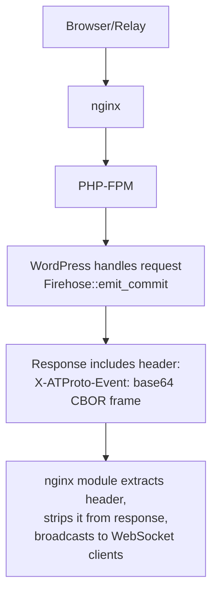
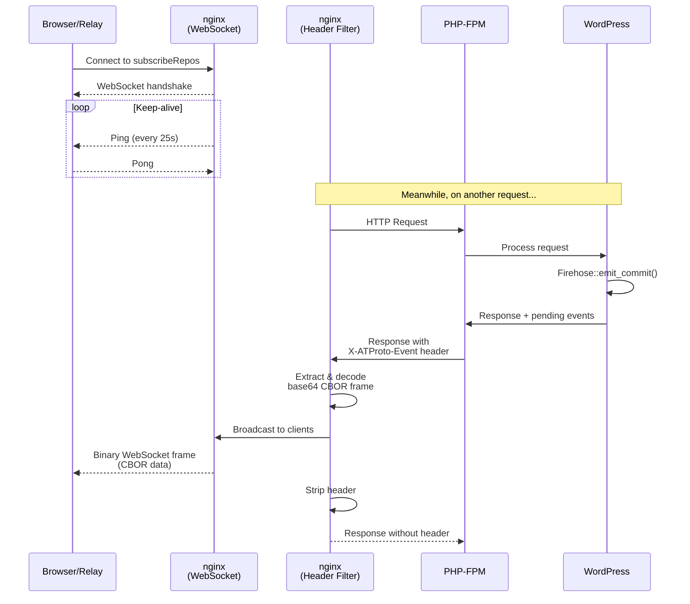

# AT Protocol Firehose nginx Module

An nginx module that provides WebSocket handling for the AT Protocol `subscribeRepos` endpoint and broadcasts events from PHP responses.

## Overview

This module replaces the Node.js WebSocket bridge with native nginx functionality:

- Handles WebSocket upgrades for the `subscribeRepos` endpoint
- Intercepts `X-ATProto-Event` headers from PHP/FastCGI responses
- Broadcasts CBOR-encoded events to all connected WebSocket clients
- Maintains keep-alive with configurable ping intervals

## Architecture



### Detailed Flow



## How the Header Bridge Works

The module uses HTTP headers as a communication channel between PHP and nginx. This avoids the need for shared memory, sockets, or external message queues.

### PHP Side

When WordPress emits a firehose event (e.g., publishing a post), the `Firehose` class immediately emits an HTTP header:

```php
// In Firehose::emit_header()
$cbor_frame = self::encode_events( array( $event ) );
header( 'X-ATProto-Event: ' . base64_encode( $cbor_frame ), false );
```

The `false` parameter allows multiple headers with the same name. If a single request triggers multiple events, each gets its own header.

The header value is base64-encoded because HTTP headers cannot contain binary data. The CBOR frame format is already defined by AT Protocol.

### nginx Side

The module installs a header filter that runs on every response passing through nginx. For each `X-ATProto-Event` header it finds:

1. **Decode**: Base64-decode the header value back to binary CBOR
2. **Broadcast**: Send the binary data as a WebSocket frame to all connected clients
3. **Strip**: Remove the header from the response so it never reaches the browser

```c
// Simplified from ngx_http_atproto_firehose_header_filter()
for each header matching "X-ATProto-Event" {
    decoded = base64_decode(header.value);
    broadcast_to_websocket_clients(decoded);
    header.hash = 0;  // Strip from response
}
```

This design keeps PHP simple (just emit headers) and makes nginx responsible for the WebSocket complexity.

## Building

### Prerequisites

- nginx source code (matching your nginx version)
- C compiler (gcc or clang)
- nginx development headers

### As a Dynamic Module

```bash
# Download nginx source matching your version
nginx -v  # Check version
wget http://nginx.org/download/nginx-1.24.0.tar.gz
tar xzf nginx-1.24.0.tar.gz
cd nginx-1.24.0

# Configure with the module
./configure --with-compat --add-dynamic-module=/path/to/wordpress-atproto/nginx

# Build the module
make modules

# Install
sudo cp objs/ngx_http_atproto_firehose_module.so /etc/nginx/modules/
```

### As a Static Module

```bash
cd nginx-1.24.0
./configure --add-module=/path/to/wordpress-atproto/nginx
make
sudo make install
```

### Using Docker

```dockerfile
FROM nginx:1.24 AS builder

RUN apt-get update && apt-get install -y \
    build-essential \
    libpcre3-dev \
    zlib1g-dev \
    wget

RUN wget http://nginx.org/download/nginx-1.24.0.tar.gz \
    && tar xzf nginx-1.24.0.tar.gz

COPY nginx/ /src/nginx-module/

RUN cd nginx-1.24.0 \
    && ./configure --with-compat --add-dynamic-module=/src/nginx-module \
    && make modules

FROM nginx:1.24
COPY --from=builder /nginx-1.24.0/objs/ngx_http_atproto_firehose_module.so /etc/nginx/modules/
```

## Configuration

### Directives

#### atproto_firehose

- **Syntax:** `atproto_firehose on | off;`
- **Default:** `off`
- **Context:** `http`

Enables or disables the firehose module globally.

#### atproto_firehose_ping_interval

- **Syntax:** `atproto_firehose_ping_interval time;`
- **Default:** `25s`
- **Context:** `http`

Sets the interval between WebSocket ping frames sent to connected clients.

#### atproto_firehose_endpoint

- **Syntax:** `atproto_firehose_endpoint;`
- **Default:** -
- **Context:** `location`

Marks a location as the WebSocket endpoint for subscribeRepos connections.

### Example Configuration

```nginx
load_module modules/ngx_http_atproto_firehose_module.so;

http {
    atproto_firehose on;
    atproto_firehose_ping_interval 25s;

    server {
        listen 80;

        # WebSocket endpoint
        location = /xrpc/com.atproto.sync.subscribeRepos {
            atproto_firehose_endpoint;
        }

        # PHP-FPM for other requests
        location ~ \.php$ {
            fastcgi_pass unix:/var/run/php-fpm.sock;
            include fastcgi_params;
            fastcgi_param SCRIPT_FILENAME $document_root$fastcgi_script_name;
        }
    }
}
```

See `nginx.conf.example` for a complete configuration.

## How It Works

1. **WebSocket Connections**: When a client connects to the `atproto_firehose_endpoint` location, the module performs the WebSocket handshake and adds the client to a connection pool.

2. **Keep-Alive**: The module sends WebSocket ping frames at the configured interval to keep connections alive and detect disconnected clients.

3. **Header Interception**: For all HTTP responses, the module's header filter checks for the `X-ATProto-Event` header. When found:
   - The base64-encoded value is decoded
   - The binary data is broadcast to all connected WebSocket clients as binary frames
   - The header is stripped from the response to the original client

4. **Broadcasting**: Events are sent as WebSocket binary frames (opcode 0x02) containing the raw CBOR data. PHP handles all CBOR encoding—nginx is just a transport.

## Testing

### Test WebSocket Endpoint

```bash
# Using websocat
websocat ws://localhost/xrpc/com.atproto.sync.subscribeRepos

# Using wscat
wscat -c ws://localhost/xrpc/com.atproto.sync.subscribeRepos
```

### Test PHP Header Emission

```bash
# Create a post and check for the header
curl -v -X POST http://localhost/wp-json/xrpc/com.atproto.repo.createRecord \
  -H "Content-Type: application/json" \
  -d '{"collection":"app.bsky.feed.post","record":{"text":"test"}}'
```

### Test Full Flow

1. Connect a client to the WebSocket endpoint
2. Publish a WordPress post
3. Verify the CBOR frame is received on the WebSocket connection

## Troubleshooting

### Module not loading

Check nginx error log:
```bash
nginx -t  # Test configuration
tail -f /var/log/nginx/error.log
```

### No events being broadcast

1. Verify `atproto_firehose on;` is in your config
2. Check that PHP is emitting the `X-ATProto-Event` header
3. Verify WebSocket clients are connected

### WebSocket connections dropping

- Increase `proxy_read_timeout` and `proxy_send_timeout`
- Check firewall/load balancer timeout settings
- Verify ping interval is less than any intermediate timeout

## Fallback

The Node.js bridge (`bridge/firehose.js`) remains available for environments without nginx or where installing custom modules isn't feasible. The two approaches are compatible—events flow through whichever mechanism is configured.

## License

Same license as the WordPress ATProto plugin.
